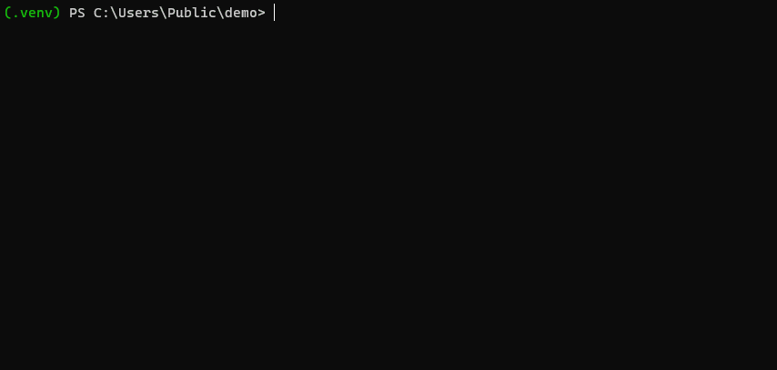

# WebLodge

**WebLodge** is a command line aiming to provide anyone with deployment and cloud management capabilities.

## Prerequisites

- Install the command line with `pip install weblodge`.
- A Python [Flask](https://flask.palletsprojects.com/en/2.3.x/) application.
- A `requirements.txt` with the application dependencies. 
- Have an [Azure account](https://azure.microsoft.com/en-us/free).

> Note: By default, **WebLodge** uses **Free** [Azure services](https://azure.microsoft.com/en-us/pricing/free-services) and lets the user specify non-free configurations.


> Note: Today, **WebLodge** is only available for **Flask** applications.


## Deploying an application

The simple way to deploy your local application is by running the command line `weblodge deploy --build` in your application directory.

In that case, **WebLodge** will assume that your application entry point is named `app.py` and your dependencies file is `requirements.txt`.

Behind the scene, **WebLodge** *build* then *deploy* your application.



## Application structure

**WebLodge** is sensible to the application structure. Applications must follow the pre-defined pattern or specify custom values.

Here is an example of the standard pattern deployable without configuration:
```
$ cat app.py  # The application filename entry point.
from flask import Flask

app = Flask(__name__)  # The Flask application.

@app.route("/")
def hello_world():
    return "<p>Hello, World!</p>"
```
It can be deployed with `weblodge deploy --build`.

Here is a non-standard example:
```
$ cat main.py  # The application filename entry point.
from flask import Flask

my_app = Flask(__name__)  # The Flask application.

@app.route("/")
def hello_world():
    return "<p>Hello, World!</p>"
```
To be able to deploy the application, you must first *build* it and specify:
- The entry point file: `main.py`.
- The **Flask** application: `my_app`.
```
# Build the application.
weblodge build --entry-point main.py --flask-app my_app
# Deploy the application.
weblodge deploy
```

## Build

The *build* operation collects and prepares the application for deployment on a specific platform.

The *build* operation can handle the following options:
| Option name | Description | Default value |
|-|-|-|
| src | Folder containing application sources. | `.` |
| dist | Folder containing the application built. | `dist` |
| entry-point | The application file to be executed with `python`. | `app.py` |
| flask-app | The Flask application object in the `entry-point` file. | `app` |
| requirements | The **requirements.txt** file path of the application. Ignores if a `requirements.txt` file is located at the root of the application. | `requirements.txt` |

> Note: Here, the platform is implicitly [Azure App Service](https://azure.microsoft.com/en-us/products/app-service/web).

Example:
```
# Build the local application.
weblodge build

# Build the application in the 'myapp' folder.
weblodge build --src myapp
```

## Deploy

The *deploy* operation creates the necessary infrastructure and uploads the build package - i.e. your code - on the infrastructure.

| Option name | Description | Default value |
|-|-|-|
| subdomain | The subdomain of the application on the Internet: `<subdomain>.azurewebsites.net`. Randomly generated if not provided. | `<randomly generated>` |
| sku | The application [computational power](https://azure.microsoft.com/en-us/pricing/details/app-service/linux/). | `F1` |
| location | The physical application location. | `northeurope` |
| environment | The environment of your application. | `development` |
| dist | Folder containing the application built. | `dist` |

Example:
```
# Deploy the local application.
weblodge deploy

# Deploy the local application with a custom subdomain.
weblodge deploy --subdomain myapp
```

> **ℹ️ Note**
>
> WebLodge considers the `subdomain` as the application name.

## Delete

The *delete* operation deletes the infrastructure deployed but keeps the build.

| Option name | Description | Default value |
|-|-|-|
| subdomain | The subdomain of the application to be deleted. | `<my-subdomain>` |
| yes | Do not prompt a validation message before deletion. | `false` |


Example:
```
# Delete the application previously deployed.
weblodge delete
```


## Logs

The *logs* operation streams your application logs. Because it is a stream, logs are truncated.

| Option name | Description | Default value |
|-|-|-|
| subdomain | The subdomain of the application. | `<my-subdomain>` |

Example:
```
# Print logs of the application previously created.
weblodge logs
```

*** Log buffering ***

Logs can be buffered and never appear in the stream.

If you use the [print](https://docs.python.org/3/library/functions.html#print) method, you can force logs to be written to the console by sending them to the [stderr](https://docs.python.org/3/library/sys.html#sys.stderr) output or by using the `flush` option.

If you use the [logging](https://docs.python.org/3/library/logging.html) module, only logs starting at the `WARNING` level will be displayed by default. Otherwise, update the [logging level](https://docs.python.org/3/library/logging.html#logging.Logger.setLevel) module to the required level.

## Configuration file: `.weblodge.json`

At the end of a deployment, **WebLodge** creates a file named `.weblodge.json` by default.
This file contains the previous configuration, enabling **WebLodge** to update your application with the same parameters. This file can be version-controlled and used in your Continuous Deployment.

You can change the name of this file with the `--config-filename` option.

Example:
```
weblodge build --config-filename myconfigfile.json
```

## Manage your WebLodge-deployed application

Managing and updating is a daily infrastructure task with no visible value for the end user.
**WebLodge** uses an Azure [Platform as a Service](https://azure.microsoft.com/en-in/resources/cloud-computing-dictionary/what-is-paas/)
resource named [Azure App Service](https://learn.microsoft.com/en-us/azure/app-service/)
to keep your infrastructure as secure, up-to-date and reliable as possible.
This tool keeps your infrastructure at the state-of-the-art, allowing you to focus on your application's functionality.

But whatever your infrastructure tools are, it's your responsibility to keep your application secure and your dependencies up-to-date.

## Feedbacks

Feel free to create issues with bugs, ideas and any constructive feedback.
