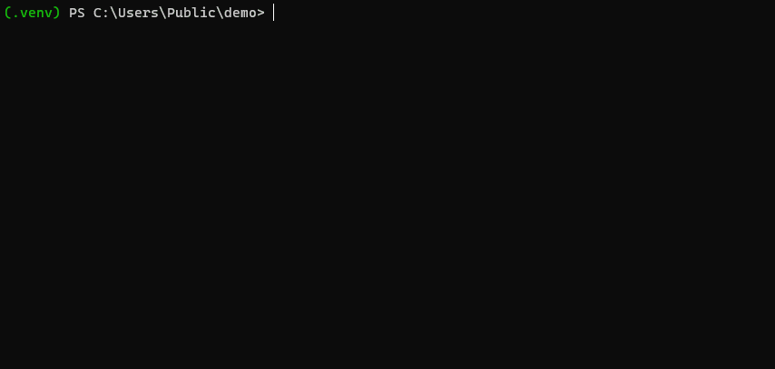

.. WebLodge documentation master file, created by
   sphinx-quickstart on Sun Jul 23 11:15:41 2023.
   You can adapt this file completely to your liking, but it should at least
   contain the root `toctree` directive.

Welcome to WebLodge's documentation!
====================================

**WebLodge** is a command line aiming to provide anyone with deployment and cloud management capabilities.

Disclaimer
----------

Today, **WebLodge** works only with **Azure** and **Python Flask** applications.

Install
-------

.. code-block:: console

   $ pip install weblodge

Deploy
-------

The simple way to deploy your local application is by running in your application directory the command line:

.. code-block:: console

   $ weblodge deploy --build

In that case, **WebLodge** will assume that your application entry point is named `app.py` and your dependencies file is `requirements.txt`.

.. toctree::

   commands

Feedbacks
---------

Feel free to create issues with bugs, ideas and any constructive feedback.
